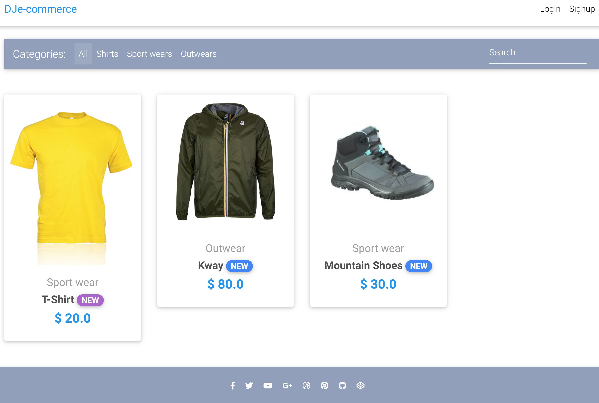
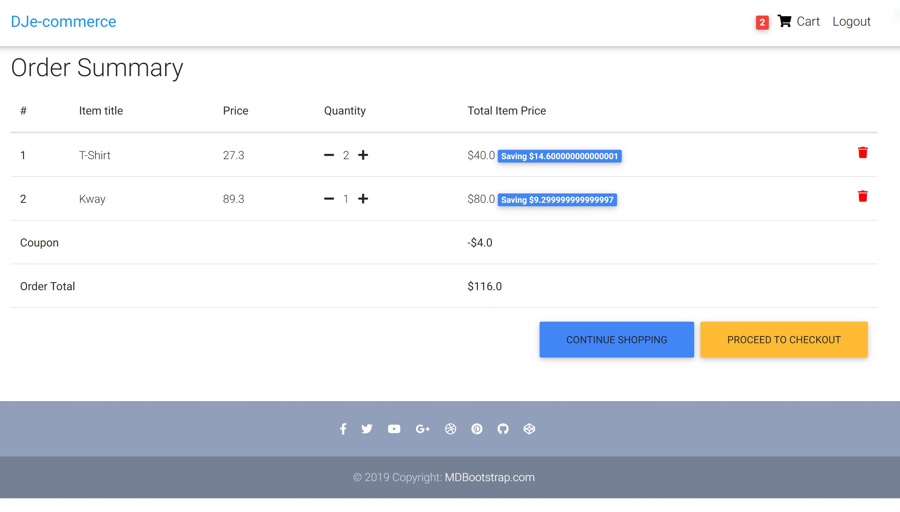
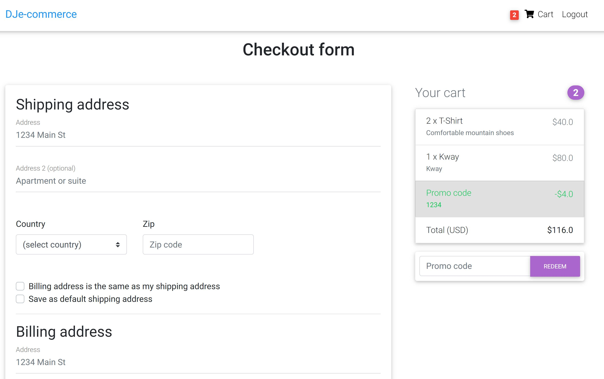

# TVSWProject

    

Applicazione web scritta in django di un sito ecommerce e completa fase di testing e verifica del codice. 
CI con github actions.

Vedi documentazione nel file "**Documentazione.pdf**". 

## Struttura 

La cartella "TVSWProject" contiene l'intera applicazione scritta in django. 

Inoltre all'interno della cartella "ProgettoTVSW" vi sono:

1. **Asmeta**: due modelli asmeta. Il primo più complesso per simularlo con avalla e estrarne degli scenari di validazione, il secondo meno complesso per per fare model checking in asmetaSMV e usare il model advisor

2. **Yakindu**: MBT

3. **MCDC**: file excel in cui viene analizzato il Modified condition/decision coverage di un form dell'applicazione

4. **Ctwedge**: Combinatorial Testing Web-based Editor and Generator per combinatorial testing

## Setup e Run applicazione 

Installazione dei package
~~~python
pip install -r requirements.txt
~~~

Run applicazione

~~~python
python manage.py runserver
~~~

Run dei test (compreso il test selenium)

~~~python
python manage.py test -v2
~~~

## Applicazione

**Homepage**

**Carrello**
     

     
**Procedura di pagamento**
     

     

## Diritti di autore

Progetto iniziale di Matthew Freire, mattfreire su github. 
